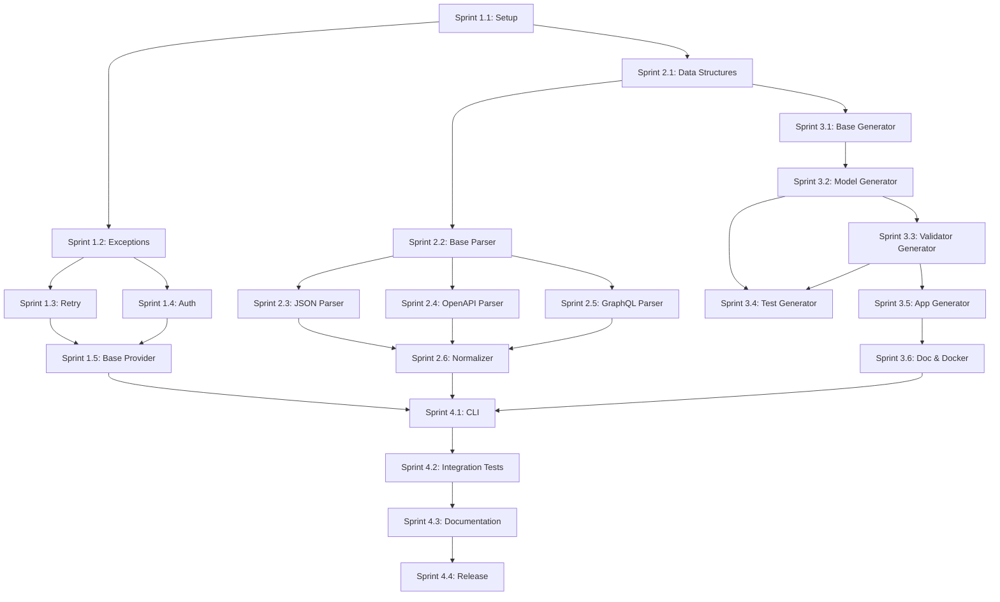

# Implementation Roadmap - DataSentinel

This document provides a detailed, prioritized implementation plan with sprints, deliverables, and dependencies.

---

## Overview

**Total Duration:** 4 weeks (16 sprints of 2-3 days each)

**Team Size:** 2 developers (as per README.md)

**Methodology:** Agile with 2-3 day sprints

---

## Phase 1: Foundation (Week 1)

**Goal:** Core infrastructure and basic parsing capability

### Sprint 1.1: Project Setup & Core Infrastructure (Days 1-2)

**Objective:** Set up project structure and configuration management

**Tasks:**
- [ ] Initialize Git repository with proper .gitignore
- [ ] Create complete folder structure
- [ ] Set up [`requirements.txt`](requirements.txt) with all dependencies
- [ ] Set up [`requirements-dev.txt`](requirements-dev.txt) with dev tools
- [ ] Create [`setup.py`](setup.py) and [`pyproject.toml`](pyproject.toml)
- [ ] Implement [`config/settings.py`](config/settings.py) with Pydantic Settings
- [ ] Implement [`config/logging_config.py`](config/logging_config.py) with Loguru
- [ ] Create [`.env.example`](.env.example) template
- [ ] Set up pytest configuration in [`tests/conftest.py`](tests/conftest.py)

**Deliverables:**
- ✅ Working project structure
- ✅ Configuration management system
- ✅ Logging system configured
- ✅ Testing framework ready

**Dependencies:** None

**Acceptance Criteria:**
- All folders created and documented
- Settings can be loaded from environment variables
- Logs are written to console and file
- pytest runs successfully (even with no tests)

---

### Sprint 1.2: Exception Hierarchy & Utilities (Day 3)

**Objective:** Create foundation for error handling and shared utilities

**Tasks:**
- [ ] Implement [`core/exceptions.py`](core/exceptions.py) with all exception classes
- [ ] Implement [`core/utils.py`](core/utils.py) with helper functions
- [ ] Write unit tests for exceptions
- [ ] Write unit tests for utilities
- [ ] Document exception usage patterns

**Deliverables:**
- ✅ Complete exception hierarchy
- ✅ Utility functions for file I/O, hashing, validation
- ✅ 100% test coverage for exceptions and utils

**Dependencies:** Sprint 1.1

**Acceptance Criteria:**
- All custom exceptions defined with clear messages
- Utility functions handle edge cases properly
- All tests pass

---

### Sprint 1.3: Retry Handler (Days 4-5)

**Objective:** Implement resilient retry logic with exponential backoff

**Tasks:**
- [ ] Implement [`core/retry_handler.py`](core/retry_handler.py)
- [ ] Create `@retry_with_backoff` decorator
- [ ] Implement `calculate_backoff()` function with jitter
- [ ] Write unit tests for retry logic
- [ ] Test with simulated network failures
- [ ] Document retry configuration options

**Deliverables:**
- ✅ Working retry decorator
- ✅ Configurable backoff strategy
- ✅ 95%+ test coverage

**Dependencies:** Sprint 1.2

**Acceptance Criteria:**
- Decorator successfully retries failed async functions
- Exponential backoff with jitter works correctly
- Max retries are respected
- Appropriate exceptions are caught and retried

---

### Sprint 1.4: Authentication Manager (Days 6-7)

**Objective:** Implement authentication strategies

**Tasks:**
- [ ] Implement [`core/auth_manager.py`](core/auth_manager.py)
- [ ] Create `AuthHandler` abstract base class
- [ ] Implement `APIKeyAuth` class
- [ ] Implement `BearerAuth` class
- [ ] Implement `OAuth2Auth` class with token refresh
- [ ] Create `AuthManager` factory
- [ ] Write unit tests for each auth type
- [ ] Test OAuth2 token refresh logic

**Deliverables:**
- ✅ Complete authentication system
- ✅ Support for API Key, Bearer, OAuth2
- ✅ Token refresh for OAuth2
- ✅ 90%+ test coverage

**Dependencies:** Sprint 1.3

**Acceptance Criteria:**
- Each auth type correctly injects credentials
- OAuth2 automatically refreshes expired tokens
- Factory pattern works for all auth types

---

### Sprint 1.5: Base Provider (Days 8-9)

**Objective:** Create abstract base for API interactions

**Tasks:**
- [ ] Implement [`core/base_provider.py`](core/base_provider.py)
- [ ] Integrate retry handler
- [ ] Integrate auth manager
- [ ] Implement `fetch()` method with httpx
- [ ] Implement `introspect_endpoint()` method
- [ ] Write unit tests with mocked HTTP calls
- [ ] Test retry integration
- [ ] Test auth integration

**Deliverables:**
- ✅ Working base provider
- ✅ Integrated retry and auth
- ✅ 90%+ test coverage

**Dependencies:** Sprint 1.3, Sprint 1.4

**Acceptance Criteria:**
- Base provider successfully makes HTTP requests
- Retry logic is triggered on failures
- Authentication is injected correctly
- Endpoint introspection works

---

## Phase 2: Data Structures & Parsers (Week 2)

**Goal:** Implement all three input parsers with normalized output

### Sprint 2.1: Data Structures (Days 10-11)

**Objective:** Define all internal data structures

**Tasks:**
- [ ] Implement [`schemas/api_schema.py`](schemas/api_schema.py)
- [ ] Implement [`schemas/field_schema.py`](schemas/field_schema.py)
- [ ] Implement [`schemas/config_schema.py`](schemas/config_schema.py)
- [ ] Add Pydantic validation for all schemas
- [ ] Create example schema instances
- [ ] Write unit tests for schema validation
- [ ] Document schema relationships

**Deliverables:**
- ✅ Complete schema definitions
- ✅ Pydantic validation
- ✅ Example data structures
- ✅ 100% test coverage

**Dependencies:** Sprint 1.1

**Acceptance Criteria:**
- All schemas are properly typed with Pydantic
- Validation catches invalid data
- Schemas can be serialized to/from JSON

---

### Sprint 2.2: Base Parser (Day 12)

**Objective:** Create abstract parser interface

**Tasks:**
- [ ] Implement [`parsers/base_parser.py`](parsers/base_parser.py)
- [ ] Define abstract methods
- [ ] Add helper methods for common operations
- [ ] Write tests for base functionality
- [ ] Document parser contract

**Deliverables:**
- ✅ Abstract parser interface
- ✅ Helper methods
- ✅ Documentation

**Dependencies:** Sprint 2.1

**Acceptance Criteria:**
- Abstract methods are properly defined
- Helper methods work correctly
- Contract is clear for implementers

---

### Sprint 2.3: JSON Inference Parser (Days 13-14)

**Objective:** Implement type inference engine

**Tasks:**
- [ ] Implement [`parsers/json_inference_parser.py`](parsers/json_inference_parser.py)
- [ ] Create `_infer_model_from_json()` method
- [ ] Implement `_infer_field_type()` method
- [ ] Add `_detect_string_pattern()` for email, URL, UUID, dates
- [ ] Handle nested objects recursively
- [ ] Handle arrays with type inference
- [ ] Write tests with various JSON structures
- [ ] Test with real-world JSON examples

**Deliverables:**
- ✅ Working JSON inference engine
- ✅ Pattern detection for common types
- ✅ Recursive handling of nested structures
- ✅ 90%+ test coverage

**Dependencies:** Sprint 2.2

**Acceptance Criteria:**
- Parser correctly infers types from JSON
- Patterns are detected (email, URL, UUID, dates)
- Nested structures are handled
- Arrays are properly typed

---

### Sprint 2.4: OpenAPI Parser (Days 15-17)

**Objective:** Implement deterministic OpenAPI/Swagger parser

**Tasks:**
- [ ] Implement [`parsers/openapi_parser.py`](parsers/openapi_parser.py)
- [ ] Integrate prance for $ref resolution
- [ ] Implement `_parse_paths()` method
- [ ] Implement `_parse_components()` method
- [ ] Add `_map_openapi_type()` method
- [ ] Implement `_extract_validators()` method
- [ ] Handle oneOf, anyOf, allOf schemas
- [ ] Support both OpenAPI 3.x and Swagger 2.x
- [ ] Test with Petstore example
- [ ] Test with Meteomatics example
- [ ] Test with complex schemas

**Deliverables:**
- ✅ Deterministic OpenAPI parser
- ✅ Full $ref resolution
- ✅ Support for OpenAPI 3.x and Swagger 2.x
- ✅ 90%+ test coverage

**Dependencies:** Sprint 2.2

**Acceptance Criteria:**
- Parser handles both OpenAPI 3.x and Swagger 2.x
- All $ref references are resolved
- Complex schemas (oneOf, anyOf, allOf) are handled
- Validation constraints are extracted

---

### Sprint 2.5: GraphQL Parser (Days 18-19)

**Objective:** Implement GraphQL introspection parser

**Tasks:**
- [ ] Implement [`parsers/graphql_parser.py`](parsers/graphql_parser.py)
- [ ] Create introspection query
- [ ] Implement `_execute_introspection()` method
- [ ] Implement `_parse_graphql_types()` method
- [ ] Implement `_parse_graphql_operations()` method
- [ ] Add `_map_graphql_type()` method
- [ ] Handle custom scalars
- [ ] Test with public GraphQL APIs (GitHub, SpaceX)
- [ ] Test with complex nested types

**Deliverables:**
- ✅ Working GraphQL introspection
- ✅ Type mapping to Pydantic
- ✅ Query/mutation to endpoint conversion
- ✅ 90%+ test coverage

**Dependencies:** Sprint 2.2

**Acceptance Criteria:**
- Introspection query executes successfully
- GraphQL types are mapped to Pydantic models
- Queries and mutations become endpoints
- Custom scalars are handled

---

### Sprint 2.6: Schema Normalizer (Day 20)

**Objective:** Normalize all parser outputs

**Tasks:**
- [ ] Implement [`parsers/schema_normalizer.py`](parsers/schema_normalizer.py)
- [ ] Add schema validation
- [ ] Implement field name normalization
- [ ] Add type conflict resolution
- [ ] Implement duplicate model merging
- [ ] Write tests with outputs from all parsers
- [ ] Document normalization rules

**Deliverables:**
- ✅ Consistent schema normalization
- ✅ Validation of parsed schemas
- ✅ 95%+ test coverage

**Dependencies:** Sprint 2.3, Sprint 2.4, Sprint 2.5

**Acceptance Criteria:**
- All parser outputs are normalized consistently
- Field names are in snake_case
- Type conflicts are resolved
- Duplicate models are merged

---

## Phase 3: Generators (Week 3)

**Goal:** Implement all code generators

### Sprint 3.1: Base Generator & Templates (Days 21-22)

**Objective:** Create generator foundation and Jinja2 templates

**Tasks:**
- [ ] Implement [`generators/base_generator.py`](generators/base_generator.py)
- [ ] Set up Jinja2 environment with custom filters
- [ ] Create [`templates/model.py.j2`](templates/model.py.j2)
- [ ] Create [`templates/validator.py.j2`](templates/validator.py.j2)
- [ ] Create [`templates/test.py.j2`](templates/test.py.j2)
- [ ] Create [`templates/app.py.j2`](templates/app.py.j2)
- [ ] Create [`templates/data_dict.md.j2`](templates/data_dict.md.j2)
- [ ] Create [`templates/Dockerfile.j2`](templates/Dockerfile.j2)
- [ ] Create [`templates/README.md.j2`](templates/README.md.j2)
- [ ] Test template rendering
- [ ] Integrate black for code formatting

**Deliverables:**
- ✅ Base generator with template rendering
- ✅ All Jinja2 templates
- ✅ Code formatting integration

**Dependencies:** Sprint 2.1

**Acceptance Criteria:**
- Templates render correctly with sample data
- Generated code is properly formatted
- Base generator provides common functionality

---

### Sprint 3.2: Model Generator (Days 23-24)

**Objective:** Generate Pydantic v2 models

**Tasks:**
- [ ] Implement [`generators/model_generator.py`](generators/model_generator.py)
- [ ] Implement `_collect_imports()` method
- [ ] Implement `_generate_field_definition()` method
- [ ] Implement `_generate_validators()` method
- [ ] Handle nested models
- [ ] Add docstrings to generated models
- [ ] Test with various schema types
- [ ] Verify generated code is valid Python
- [ ] Test generated models can be imported

**Deliverables:**
- ✅ Working model generator
- ✅ Generated models with validators
- ✅ Valid, importable Python code

**Dependencies:** Sprint 3.1

**Acceptance Criteria:**
- Generated models are valid Pydantic v2 code
- Field constraints are properly applied
- Validators are generated for complex rules
- Code passes linting (black, mypy)

---

### Sprint 3.3: Validator Generator (Days 25-26)

**Objective:** Generate validation logic with retry and drift detection

**Tasks:**
- [ ] Implement [`generators/validator_generator.py`](generators/validator_generator.py)
- [ ] Implement `_generate_endpoint_validator()` method
- [ ] Add schema drift detection logic
- [ ] Generate ValidationResult model
- [ ] Implement batch validation
- [ ] Test generated validators
- [ ] Verify retry logic is integrated
- [ ] Test drift detection

**Deliverables:**
- ✅ Working validator generator
- ✅ Retry logic integration
- ✅ Schema drift detection
- ✅ Valid Python code

**Dependencies:** Sprint 3.2

**Acceptance Criteria:**
- Generated validators work correctly
- Retry logic is properly integrated
- Drift detection alerts on schema changes
- ValidationResult provides clear feedback

---

### Sprint 3.4: Test Generator (Days 27-28)

**Objective:** Generate pytest test suite

**Tasks:**
- [ ] Implement [`generators/test_generator.py`](generators/test_generator.py)
- [ ] Implement `_generate_factories()` with polyfactory
- [ ] Implement `_generate_endpoint_tests()` method
- [ ] Generate success test cases
- [ ] Generate error test cases
- [ ] Generate edge case tests
- [ ] Add mock setup for external APIs
- [ ] Test generated test suite
- [ ] Verify tests are executable

**Deliverables:**
- ✅ Working test generator
- ✅ Polyfactory integration
- ✅ Comprehensive test coverage
- ✅ Executable test suite

**Dependencies:** Sprint 3.2, Sprint 3.3

**Acceptance Criteria:**
- Generated tests are valid pytest code
- Tests cover success, error, and edge cases
- Mocks are properly configured
- Generated tests pass when run

---

### Sprint 3.5: App Generator (Day 29)

**Objective:** Generate FastAPI application

**Tasks:**
- [ ] Implement [`generators/app_generator.py`](generators/app_generator.py)
- [ ] Generate FastAPI app instance
- [ ] Generate validation endpoints
- [ ] Add health check endpoint
- [ ] Configure CORS
- [ ] Add error handlers
- [ ] Test generated app
- [ ] Verify app runs with uvicorn

**Deliverables:**
- ✅ Working FastAPI app generator
- ✅ Validation endpoints
- ✅ Health check
- ✅ Runnable application

**Dependencies:** Sprint 3.3

**Acceptance Criteria:**
- Generated app is valid FastAPI code
- Endpoints are properly defined
- App runs successfully with uvicorn
- API documentation is auto-generated

---

### Sprint 3.6: Documentation & Docker Generators (Day 30)

**Objective:** Generate documentation and Docker artifacts

**Tasks:**
- [ ] Implement [`generators/doc_generator.py`](generators/doc_generator.py)
- [ ] Generate comprehensive data dictionary
- [ ] Add usage examples
- [ ] Implement [`generators/docker_generator.py`](generators/docker_generator.py)
- [ ] Generate multi-stage Dockerfile
- [ ] Generate .dockerignore
- [ ] Test Docker build
- [ ] Verify container runs

**Deliverables:**
- ✅ Working documentation generator
- ✅ Working Docker generator
- ✅ Buildable Docker image

**Dependencies:** Sprint 3.5

**Acceptance Criteria:**
- Documentation is comprehensive and clear
- Dockerfile builds successfully
- Container runs the generated app
- Image is optimized for size

---

## Phase 4: Orchestration & Integration (Week 4)

**Goal:** Complete end-to-end pipeline and polish

### Sprint 4.1: CLI & Orchestration (Days 31-32)

**Objective:** Implement CLI and orchestrate entire pipeline

**Tasks:**
- [ ] Implement [`auto_sentinel.py`](auto_sentinel.py)
- [ ] Add argument parsing with argparse
- [ ] Implement `InputDetector` class
- [ ] Implement `orchestrate_generation()` function
- [ ] Add progress indicators
- [ ] Add verbose logging mode
- [ ] Implement output validation
- [ ] Test with all three input types
- [ ] Add error handling and user feedback

**Deliverables:**
- ✅ Working CLI interface
- ✅ Complete orchestration
- ✅ User-friendly output

**Dependencies:** All previous sprints

**Acceptance Criteria:**
- CLI accepts all required arguments
- Input type detection works correctly
- Pipeline executes end-to-end
- Clear progress feedback to user
- Errors are handled gracefully

---

### Sprint 4.2: Integration Testing (Days 33-34)

**Objective:** Comprehensive end-to-end testing

**Tasks:**
- [ ] Create [`tests/integration/test_openapi_flow.py`](tests/integration/test_openapi_flow.py)
- [ ] Create [`tests/integration/test_graphql_flow.py`](tests/integration/test_graphql_flow.py)
- [ ] Create [`tests/integration/test_json_flow.py`](tests/integration/test_json_flow.py)
- [ ] Test with real-world APIs
- [ ] Performance testing
- [ ] Error handling testing
- [ ] Test generated code quality
- [ ] Verify all artifacts are created

**Deliverables:**
- ✅ Comprehensive integration tests
- ✅ Performance benchmarks
- ✅ Error handling validation

**Dependencies:** Sprint 4.1

**Acceptance Criteria:**
- All integration tests pass
- Generated code works correctly
- Performance is acceptable
- Errors are handled properly

---

### Sprint 4.3: Documentation (Days 35-36)

**Objective:** Complete project documentation

**Tasks:**
- [ ] Write [`docs/getting_started.md`](docs/getting_started.md)
- [ ] Write [`docs/input_formats.md`](docs/input_formats.md)
- [ ] Write [`docs/generated_artifacts.md`](docs/generated_artifacts.md)
- [ ] Write [`docs/deployment.md`](docs/deployment.md)
- [ ] Write [`docs/api_reference.md`](docs/api_reference.md)
- [ ] Update main [`README.md`](README.md)
- [ ] Create example projects
- [ ] Record demo video
- [ ] Create architecture diagrams

**Deliverables:**
- ✅ Complete documentation
- ✅ Example projects
- ✅ Demo materials

**Dependencies:** Sprint 4.2

**Acceptance Criteria:**
- Documentation is clear and comprehensive
- Examples work correctly
- Demo showcases key features
- Architecture is well-documented

---

### Sprint 4.4: Polish & Release (Days 37-38)

**Objective:** Final polish and release preparation

**Tasks:**
- [ ] Code review and refactoring
- [ ] Performance optimization
- [ ] Security audit
- [ ] Update [`CHANGELOG.md`](CHANGELOG.md)
- [ ] Create release notes
- [ ] Tag version 1.0.0
- [ ] Build Docker image for Docker Hub
- [ ] Prepare PyPI package
- [ ] Final testing on clean environment

**Deliverables:**
- ✅ Production-ready code
- ✅ Release package
- ✅ Deployment artifacts

**Dependencies:** Sprint 4.3

**Acceptance Criteria:**
- Code passes all quality checks
- No known critical bugs
- Release notes are complete
- Package is ready for distribution

---

## Dependency Graph

---

## Risk Management

### High-Risk Items

1. **OpenAPI $ref Resolution**
   - Risk: Complex nested references may not resolve correctly
   - Mitigation: Use battle-tested prance library, extensive testing

2. **GraphQL Introspection**
   - Risk: Some GraphQL servers may disable introspection
   - Mitigation: Document requirement, provide fallback options

3. **Type Inference Accuracy**
   - Risk: JSON inference may produce incorrect types
   - Mitigation: Pattern detection, multiple sample support, user review

4. **Generated Code Quality**
   - Risk: Generated code may not be production-ready
   - Mitigation: Extensive testing, code formatting, linting integration

### Medium-Risk Items

1. **OAuth2 Token Refresh**
   - Risk: Token refresh logic may fail with some providers
   - Mitigation: Test with multiple OAuth2 providers

2. **Template Complexity**
   - Risk: Jinja2 templates may become hard to maintain
   - Mitigation: Keep templates simple, use macros for reuse

3. **Performance**
   - Risk: Large APIs may take too long to process
   - Mitigation: Async operations, progress indicators, optimization

---

## Success Metrics

### Code Quality
- [ ] 90%+ test coverage across all modules
- [ ] All code passes black formatting
- [ ] All code passes mypy type checking
- [ ] No critical security vulnerabilities

### Functionality
- [ ] Successfully parses OpenAPI 3.x and Swagger 2.x
- [ ] Successfully introspects GraphQL endpoints
- [ ] Successfully infers types from JSON
- [ ] Generates valid, executable code
- [ ] Generated tests pass

### Performance
- [ ] Parse typical API spec in < 5 seconds
- [ ] Generate all artifacts in < 10 seconds
- [ ] Generated validators handle 100+ req/sec

### Documentation
- [ ] Complete API reference
- [ ] Clear getting started guide
- [ ] Working examples for all input types
- [ ] Deployment guide

---

## Post-Release Roadmap (Future Phases)

### Phase 5: Advanced Features
- [ ] Schema versioning and migration
- [ ] Multi-sample JSON inference
- [ ] GraphQL subscription support
- [ ] Webhook listener generation
- [ ] Data profiling and statistics

### Phase 6: Enterprise Features
- [ ] Web UI for management
- [ ] CI/CD integration
- [ ] Monitoring and alerting
- [ ] Multi-tenant support
- [ ] Enterprise authentication (SAML, LDAP)

### Phase 7: Ecosystem
- [ ] VS Code extension
- [ ] GitHub Action
- [ ] Terraform modules
- [ ] Kubernetes Helm charts
- [ ] Cloud marketplace listings

---

## Summary

This roadmap provides:
- ✅ Clear sprint structure with 2-3 day iterations
- ✅ Explicit dependencies between sprints
- ✅ Concrete deliverables and acceptance criteria
- ✅ Risk management strategy
- ✅ Success metrics
- ✅ Future roadmap

**Ready to begin implementation in Code Mode!**